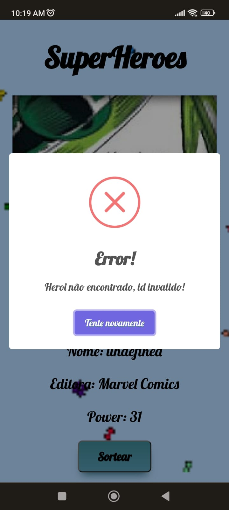

### Exercício de consumo de API

- Consumo da API [SuperHero API](https://www.superheroapi.com/)                  
- Consumo  da biblioteca [Sweetalert2](https://sweetalert2.github.io/#examples)                    
:pushpin: [Aplicação](https://api-superhero.vercel.app/)

